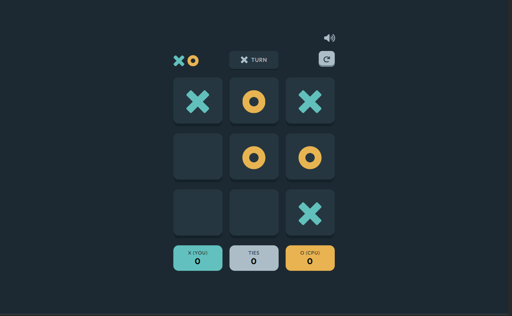

# Frontend Mentor - Tic Tac Toe solution

This is a solution to the [Tic Tac Toe challenge on Frontend Mentor](https://www.frontendmentor.io/challenges/tic-tac-toe-game-Re7ZF_E2v). Frontend Mentor challenges help you improve your coding skills by building realistic projects.

## Table of contents

- [Overview](#overview)
  - [The challenge](#the-challenge)
  - [Screenshot](#screenshot)
  - [Links](#links)
- [My process](#my-process)
  - [Built with](#built-with)
  - [What I learned](#what-i-learned)
  - [Useful resources](#useful-resources)
- [Author](#author)

## Overview

### The challenge

Users should be able to:

- View the optimal layout for the game depending on their device's screen size
- See hover states for all interactive elements on the page
- Play the game either solo vs the computer or multiplayer against another person
- Save the game state in the browser so that it’s preserved if the player refreshes their browser
- Instead of having the computer randomly make their moves, try making it clever so it’s proactive in blocking your moves and trying to win

### Screenshot

### Links

- Solution URL: [https://tic-tac-toe-game-with-cpu.netlify.app/](https://tic-tac-toe-game-with-cpu.netlify.app/)

## My process

### Built with

- Semantic HTML5 markup
- Flexbox
- CSS Grid
- Mobile-first workflow
- [React](https://reactjs.org/) - JS library
- [Styled Components](https://styled-components.com/) - For styles

### What I learned

Learned about the minimax algorithm and how to implement it. Learned more about the asynchronous nature of react state. Also learned to work with lotties and how to add an audio.

### Useful resources

- [JavaScript Tic Tac Toe Project Tutorial - Unbeatable AI w/ Minimax Algorithm](https://www.youtube.com/watch?v=P2TcQ3h0ipQ) - This helped me with the minimax algorithm.

## Author

- Frontend Mentor - [@yourusername](https://www.frontendmentor.io/profile/yourusername)
